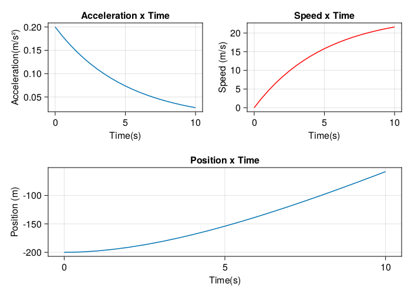

# Assignment 5
Arthur Araujo Galdino dos Santos

Available at: https://github.com/araujoarthur/metcompA/tree/main/tarefa5

# 1st Step
Define packages used


```julia
using DataFrames
using CairoMakie
```

# 2nd Step
Define position, acceleration and speed functions and the *T* constant


```julia
position(t,T) = -25 * (t + T*ℯ^(-t/T)) + 325 # ℯ is a built-in variable in julia 2.7182818284590... (\euler)
acceleration(t,T) = -ℯ^(-t/T)/T
speed(t,T) = -25 * (1 - ℯ^(-t/T))
T = 5
```


    5


# 3rd Step

Build and show the dataframe


```julia
data = DataFrame(TIME=0:0.5:10)
data.POSITION = position.(data.TIME, T)
data.ACCELERATION = acceleration.(data.TIME, T)
data.SPEED = speed.(data.TIME, T)
data
```


<div class="data-frame"><p>21 rows × 4 columns</p><table class="data-frame"><thead><tr><th></th><th>TIME</th><th>POSITION</th><th>ACCELERATION</th><th>SPEED</th></tr><tr><th></th><th title="Float64">Float64</th><th title="Float64">Float64</th><th title="Float64">Float64</th><th title="Float64">Float64</th></tr></thead><tbody><tr><th>1</th><td>0.0</td><td>200.0</td><td>-0.2</td><td>-0.0</td></tr><tr><th>2</th><td>0.5</td><td>199.395</td><td>-0.180967</td><td>-2.37906</td></tr><tr><th>3</th><td>1.0</td><td>197.659</td><td>-0.163746</td><td>-4.53173</td></tr><tr><th>4</th><td>1.5</td><td>194.898</td><td>-0.148164</td><td>-6.47954</td></tr><tr><th>5</th><td>2.0</td><td>191.21</td><td>-0.134064</td><td>-8.242</td></tr><tr><th>6</th><td>2.5</td><td>186.684</td><td>-0.121306</td><td>-9.83673</td></tr><tr><th>7</th><td>3.0</td><td>181.399</td><td>-0.109762</td><td>-11.2797</td></tr><tr><th>8</th><td>3.5</td><td>175.427</td><td>-0.0993171</td><td>-12.5854</td></tr><tr><th>9</th><td>4.0</td><td>168.834</td><td>-0.0898658</td><td>-13.7668</td></tr><tr><th>10</th><td>4.5</td><td>161.679</td><td>-0.0813139</td><td>-14.8358</td></tr><tr><th>11</th><td>5.0</td><td>154.015</td><td>-0.0735759</td><td>-15.803</td></tr><tr><th>12</th><td>5.5</td><td>145.891</td><td>-0.0665742</td><td>-16.6782</td></tr><tr><th>13</th><td>6.0</td><td>137.351</td><td>-0.0602388</td><td>-17.4701</td></tr><tr><th>14</th><td>6.5</td><td>128.434</td><td>-0.0545064</td><td>-18.1867</td></tr><tr><th>15</th><td>7.0</td><td>119.175</td><td>-0.0493194</td><td>-18.8351</td></tr><tr><th>16</th><td>7.5</td><td>109.609</td><td>-0.044626</td><td>-19.4217</td></tr><tr><th>17</th><td>8.0</td><td>99.7629</td><td>-0.0403793</td><td>-19.9526</td></tr><tr><th>18</th><td>8.5</td><td>89.6646</td><td>-0.0365367</td><td>-20.4329</td></tr><tr><th>19</th><td>9.0</td><td>79.3376</td><td>-0.0330598</td><td>-20.8675</td></tr><tr><th>20</th><td>9.5</td><td>68.8039</td><td>-0.0299137</td><td>-21.2608</td></tr><tr><th>21</th><td>10.0</td><td>58.0831</td><td>-0.0270671</td><td>-21.6166</td></tr></tbody></table></div>


# 4th Step
Build graphics

Building raw data graphics:


```julia
graphTotal = Figure(backgroundcolor=:white, resolution=(700,500))
graphAcTem = Axis(graphTotal[1,1], title="Acceleration x Time", ylabel="Acceleration(m/s²)", xlabel="Time(s)")
graphSpTem = Axis(graphTotal[1,2], title="Speed x Time", ylabel="Speed (m/s)", xlabel="Time(s)")
graphPosTem = Axis(graphTotal[2,1:2], title="Position x Time", ylabel="Position (m)", xlabel="Time(s)")
lines!(graphAcTem, data.TIME, data.ACCELERATION)
lines!(graphSpTem, data.TIME, data.SPEED, color=:red)
lines!(graphPosTem, data.TIME, data.POSITION)

```


    Lines{Tuple{Vector{Point{2, Float32}}}}


Building ascending acceleration and speed graphs


```julia
graphTotalPositive = graphTotal = Figure(backgroundcolor=:white, resolution=(700,500))
graphAcTem = Axis(graphTotal[1,1], title="Acceleration x Time", ylabel="Acceleration(m/s²)", xlabel="Time(s)")
graphSpTem = Axis(graphTotal[1,2], title="Speed x Time", ylabel="Speed (m/s)", xlabel="Time(s)")
graphPosTem = Axis(graphTotal[2,1:2], title="Position x Time", ylabel="Position (m)", xlabel="Time(s)")
lines!(graphAcTem, data.TIME, -data.ACCELERATION)
lines!(graphSpTem, data.TIME, -data.SPEED, color=:red)
lines!(graphPosTem, data.TIME, -data.POSITION)
```


    Lines{Tuple{Vector{Point{2, Float32}}}}


## Graphics


```julia
graphTotal
```


    

    


```julia
graphTotalPositive
```


    

    


```julia

```
